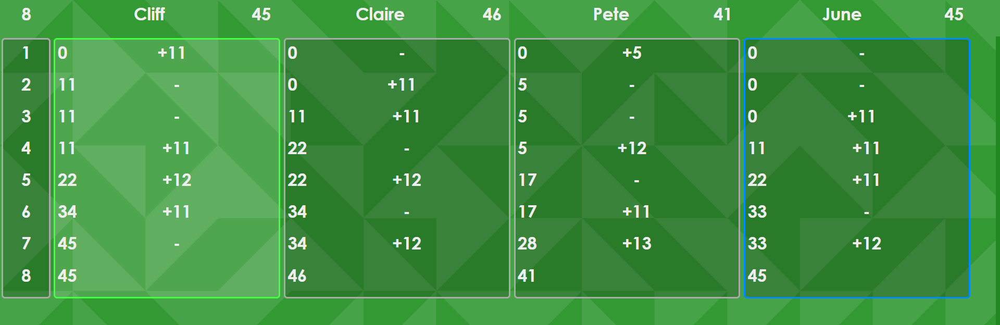

## Up and Down the River

### What's New?

v2.0.1 (3 Aug 2023)

- Implemented custom cursors to assist the visually impaired among us. Not looking at you in particular Papa Bob.

- Implemented a feature to let the scorekeeper adjust a players score if they made a boo-boo.

- The '-' that was displayed when a player did not get their claimed number of tricks has been changed to '|-|' so it looks a bit more like a ladder when players fail many times in a row :D

- Contextmenus, and dragging & dropping elements disabled inside application.

- Tweaked more styles

- Updated rules.

v2.0.0 (28 Jul 2023)

- Changed to a 3 row layout using CSS grid.

- The top grid row is a sticky header which always displays the current round, player names, and their scores.

- The middle grid row contains the information about all played rounds.

- The bottom grid row contains all of the ingame UI elements for bidding on and claiming tricks.

- When progressing, the content panel always scrolls to the bottom ensuring new content is always visible.

- Added a "misdeal" button which will negate and restart the current round.

- Added persistent game history for local machine.

- Added a background image rendered using truchet tiles so the background is slightly different each time.Modified color palettes.

- Renamed multiple variables to enhance overall code redability.

- Added placeholder code and HTML for possible custom user application settings.

- Preferred font is now "Century Gothic". It just looks better and is easier to read from a distance.

- Dealer and Leader are now identified by their respective colored borders only.

- Styled scrollbar so it looks the same in Firefox and Chrome.

- Increased the size of the standard buttons.

- Increased border radus of many elements to make them stand out more.

- Many other small styling tweaks.

- Updated rules.

v1.0.0 (15 May 2023)

- Initial public release.

### About

Up and Down the River is a single page web application created to keep score when playing the card game Up and Down the River.

Up and Down the River mostly exists because I'm so terribly inept at scoring with pen and paper :D

Up and Down the River has been mashed into a single file because it refuses to function on my Android tablet when it is split into its component parts (HTML, CSS, and JavaScript).

Up and Down the River has been tested working in Firefox and Chrome on Windows10, your mileage may vary with other browsers and operating systems.

Anyway, if you have any questions or suggestions just raise an issue.